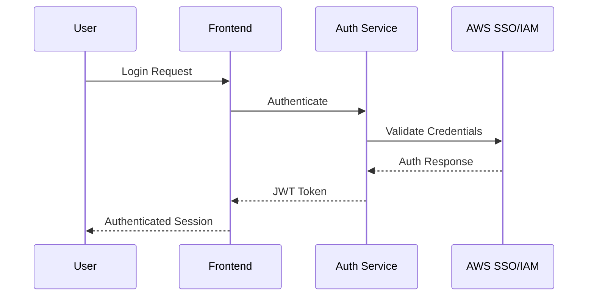

# System Architecture Document
# AWS S3 Manager Web Interface

**Document Version**: 1.0  
**Date**: August 11, 2025  
**Author**: Architecture Team  
**Project**: AWS S3 Manager  

---

## Table of Contents

1. [Introduction](#1-introduction)
2. [System Overview](#2-system-overview)
3. [Architecture Patterns](#3-architecture-patterns)
4. [Component Architecture](#4-component-architecture)
5. [Data Architecture](#5-data-architecture)
6. [Security Architecture](#6-security-architecture)
7. [Deployment Architecture](#7-deployment-architecture)
8. [Performance Architecture](#8-performance-architecture)

---

## 1. Introduction

### 1.1 Purpose
This document describes the system architecture for the AWS S3 Manager Web Interface, detailing the high-level design, components, and their interactions.

### 1.2 Scope
The architecture covers:
- Overall system design and patterns
- Component breakdown and responsibilities
- Data flow and storage strategies
- Security implementation
- Deployment and scaling strategies

### 1.3 Architecture Principles
- **Microservices**: Loosely coupled, independently deployable services
- **Cloud Native**: Designed for Kubernetes deployment
- **Security First**: Built-in security at every layer
- **Scalability**: Horizontal scaling capabilities
- **Observability**: Comprehensive monitoring and logging

---

## 2. System Overview

### 2.1 High-Level Architecture

```
┌─────────────────┐    ┌─────────────────┐    ┌─────────────────┐
│   Load Balancer │    │   API Gateway   │    │   Web Frontend  │
│    (Ingress)    │◄──►│   (Express.js)  │◄──►│   (React.js)    │
└─────────────────┘    └─────────────────┘    └─────────────────┘
                                │
                                ▼
┌─────────────────┐    ┌─────────────────┐    ┌─────────────────┐
│  Authentication │    │  Business Logic │    │   File Service  │
│   Service       │◄──►│    Service      │◄──►│   (S3 Proxy)    │
└─────────────────┘    └─────────────────┘    └─────────────────┘
         │                       │                       │
         ▼                       ▼                       ▼
┌─────────────────┐    ┌─────────────────┐    ┌─────────────────┐
│   Redis Cache   │    │   PostgreSQL    │    │     AWS S3      │
│  (Sessions)     │    │   (Metadata)    │    │   (Storage)     │
└─────────────────┘    └─────────────────┘    └─────────────────┘
```

### 2.2 Technology Stack

#### Frontend
- **React.js 18+**: Modern UI framework
- **TypeScript**: Type safety and better developer experience
- **Material-UI**: Component library for consistent design
- **React Query**: Data fetching and caching
- **React Router**: Client-side routing
- **Webpack**: Module bundling

#### Backend
- **Node.js 18+**: Runtime environment
- **Express.js**: Web application framework
- **TypeScript**: Type safety for backend code
- **AWS SDK v3**: AWS service integration
- **Joi**: Input validation
- **Winston**: Logging framework
- **Jest**: Testing framework

#### Database & Cache
- **PostgreSQL 14+**: Primary database for metadata
- **Redis 7+**: Caching and session storage
- **Prisma**: Database ORM and migrations

#### DevOps & Deployment
- **Docker**: Containerization
- **Kubernetes**: Container orchestration
- **Helm**: Package management for Kubernetes
- **Prometheus**: Metrics collection
- **Grafana**: Monitoring dashboards

---

## 3. Architecture Patterns

### 3.1 Microservices Architecture
The system is decomposed into focused microservices:

- **API Gateway**: Request routing, authentication, rate limiting
- **Auth Service**: User authentication and authorization
- **File Service**: S3 operations and file management
- **Metadata Service**: Database operations and caching
- **Notification Service**: Real-time updates and alerts

### 3.2 Event-Driven Architecture
Services communicate through events for loose coupling:

- **Event Bus**: Redis pub/sub for service communication
- **Event Sourcing**: Audit trail for all operations
- **CQRS**: Separate read/write models for optimization

### 3.3 Layered Architecture
Each service follows a layered approach:

```
┌─────────────────────────────────────┐
│          Presentation Layer         │ ← Controllers, Routes
├─────────────────────────────────────┤
│           Business Layer            │ ← Services, Domain Logic
├─────────────────────────────────────┤
│            Data Layer               │ ← Repositories, DAOs
├─────────────────────────────────────┤
│         Infrastructure Layer        │ ← External APIs, Database
└─────────────────────────────────────┘
```

---

## 4. Component Architecture

### 4.1 Frontend Components

#### 4.1.1 Component Hierarchy
```
App
├── AuthProvider
├── Router
│   ├── Dashboard
│   ├── BucketManager
│   │   ├── BucketList
│   │   ├── BucketDetails
│   │   └── BucketSettings
│   ├── ObjectManager
│   │   ├── ObjectList
│   │   ├── ObjectUpload
│   │   └── ObjectDetails
│   └── Settings
└── NotificationProvider
```

#### 4.1.2 State Management
- **React Context**: Global application state
- **React Query**: Server state and caching
- **Local State**: Component-specific state

### 4.2 Backend Services

#### 4.2.1 API Gateway Service
```typescript
interface APIGateway {
  authentication: AuthenticationMiddleware;
  rateLimit: RateLimitMiddleware;
  requestValidation: ValidationMiddleware;
  logging: LoggingMiddleware;
  routing: RouteHandler;
}
```

#### 4.2.2 Authentication Service
```typescript
interface AuthService {
  awsCredentials: AWSCredentialProvider;
  awsSSO: AWSSSOProvider;
  jwtTokens: JWTManager;
  sessions: SessionManager;
  rbac: RoleBasedAccessControl;
}
```

#### 4.2.3 File Service
```typescript
interface FileService {
  s3Client: AWS.S3;
  bucketOperations: BucketManager;
  objectOperations: ObjectManager;
  uploadManager: MultipartUploadManager;
  downloadManager: StreamDownloadManager;
}
```

---

## 5. Data Architecture

### 5.1 Data Models

#### 5.1.1 User Management
```sql
-- Users table
CREATE TABLE users (
    id UUID PRIMARY KEY,
    email VARCHAR(255) UNIQUE NOT NULL,
    name VARCHAR(255) NOT NULL,
    role user_role NOT NULL,
    aws_access_key_id VARCHAR(255),
    created_at TIMESTAMP DEFAULT NOW(),
    updated_at TIMESTAMP DEFAULT NOW()
);

-- Sessions table
CREATE TABLE user_sessions (
    id UUID PRIMARY KEY,
    user_id UUID REFERENCES users(id),
    token_hash VARCHAR(255) NOT NULL,
    expires_at TIMESTAMP NOT NULL,
    created_at TIMESTAMP DEFAULT NOW()
);
```

#### 5.1.2 S3 Metadata
```sql
-- Bucket metadata
CREATE TABLE bucket_metadata (
    id UUID PRIMARY KEY,
    bucket_name VARCHAR(255) UNIQUE NOT NULL,
    region VARCHAR(50) NOT NULL,
    created_by UUID REFERENCES users(id),
    last_accessed TIMESTAMP,
    object_count BIGINT DEFAULT 0,
    total_size BIGINT DEFAULT 0,
    created_at TIMESTAMP DEFAULT NOW()
);

-- Object metadata
CREATE TABLE object_metadata (
    id UUID PRIMARY KEY,
    bucket_name VARCHAR(255) NOT NULL,
    object_key TEXT NOT NULL,
    size BIGINT NOT NULL,
    content_type VARCHAR(255),
    etag VARCHAR(255),
    last_modified TIMESTAMP,
    created_at TIMESTAMP DEFAULT NOW(),
    UNIQUE(bucket_name, object_key)
);
```

### 5.2 Caching Strategy

#### 5.2.1 Redis Cache Structure
```
s3-manager:
├── sessions:{user_id} → User session data
├── buckets:{user_id} → User's accessible buckets
├── objects:{bucket_name} → Bucket object list cache
└── metadata:{bucket_name}:{object_key} → Object metadata cache
```

#### 5.2.2 Cache Policies
- **Session Data**: TTL 24 hours
- **Bucket Lists**: TTL 5 minutes
- **Object Lists**: TTL 2 minutes
- **Metadata**: TTL 10 minutes

---

## 6. Security Architecture

### 6.1 Authentication Flow



### 6.2 Authorization Model

#### 6.2.1 Role-Based Access Control
```typescript
enum UserRole {
  ADMIN = 'admin',
  DEVELOPER = 'developer',
  READ_ONLY = 'read_only',
  AUDITOR = 'auditor'
}

interface Permission {
  resource: string;
  actions: string[];
  conditions?: Record<string, any>;
}

const rolePermissions: Record<UserRole, Permission[]> = {
  [UserRole.ADMIN]: [
    { resource: 's3:*', actions: ['*'] }
  ],
  [UserRole.DEVELOPER]: [
    { resource: 's3:bucket/*', actions: ['read', 'write'] }
  ],
  [UserRole.READ_ONLY]: [
    { resource: 's3:*', actions: ['read'] }
  ]
};
```

### 6.3 Security Controls

#### 6.3.1 Input Validation
```typescript
const bucketNameSchema = Joi.string()
  .min(3)
  .max(63)
  .pattern(/^[a-z0-9][a-z0-9.-]*[a-z0-9]$/)
  .required();

const objectKeySchema = Joi.string()
  .max(1024)
  .pattern(/^[^<>:"*?|]+$/)
  .required();
```

#### 6.3.2 Rate Limiting
```typescript
const rateLimits = {
  upload: { window: '1m', max: 10 },
  download: { window: '1m', max: 50 },
  api: { window: '1m', max: 100 }
};
```

---

## 7. Deployment Architecture

### 7.1 Kubernetes Architecture

```yaml
apiVersion: v1
kind: Namespace
metadata:
  name: s3-manager
---
# Deployment structure
s3-manager namespace:
├── frontend-deployment (React.js)
├── api-gateway-deployment (Express.js)
├── auth-service-deployment
├── file-service-deployment
├── postgresql-statefulset
├── redis-deployment
└── monitoring-stack
```

### 7.2 Resource Requirements

#### 7.2.1 Development Environment
```yaml
resources:
  frontend:
    requests: { cpu: 100m, memory: 128Mi }
    limits: { cpu: 500m, memory: 512Mi }
  backend:
    requests: { cpu: 200m, memory: 256Mi }
    limits: { cpu: 1000m, memory: 1Gi }
  database:
    requests: { cpu: 200m, memory: 512Mi }
    limits: { cpu: 1000m, memory: 2Gi }
```

#### 7.2.2 Production Environment
```yaml
resources:
  frontend:
    replicas: 3
    requests: { cpu: 200m, memory: 256Mi }
    limits: { cpu: 1000m, memory: 1Gi }
  backend:
    replicas: 3
    requests: { cpu: 500m, memory: 512Mi }
    limits: { cpu: 2000m, memory: 2Gi }
  database:
    replicas: 1 (with backup)
    requests: { cpu: 1000m, memory: 2Gi }
    limits: { cpu: 4000m, memory: 8Gi }
```

### 7.3 Networking

#### 7.3.1 Service Mesh
```
┌─────────────────┐
│   Ingress       │ ← External traffic entry
│   Controller    │
└─────────────────┘
          │
          ▼
┌─────────────────┐
│   API Gateway   │ ← Internal service routing
│   Service       │
└─────────────────┘
          │
    ┌─────┴─────┐
    ▼           ▼
┌─────────┐ ┌─────────┐
│Frontend │ │Backend  │
│Service  │ │Services │
└─────────┘ └─────────┘
```

---

## 8. Performance Architecture

### 8.1 Scalability Strategy

#### 8.1.1 Horizontal Scaling
- **Stateless Services**: All application services are stateless
- **Load Balancing**: Round-robin with health checks
- **Auto-scaling**: Based on CPU/memory utilization
- **Database Scaling**: Read replicas for query distribution

#### 8.1.2 Caching Strategy
```typescript
interface CacheLayer {
  level1: BrowserCache;     // Client-side caching
  level2: CDN;              // Static asset caching
  level3: RedisCache;       // Application data caching
  level4: DatabaseCache;    // Query result caching
}
```

### 8.2 Performance Optimization

#### 8.2.1 Frontend Optimization
- **Code Splitting**: Route-based and component-based
- **Lazy Loading**: Dynamic imports for heavy components
- **Asset Optimization**: Image compression, minification
- **Service Workers**: Offline capability and caching

#### 8.2.2 Backend Optimization
- **Connection Pooling**: Database connection management
- **Query Optimization**: Indexed queries and pagination
- **Async Processing**: Non-blocking I/O operations
- **Response Compression**: Gzip compression for API responses

### 8.3 Monitoring and Observability

#### 8.3.1 Metrics Collection
```typescript
interface MetricsCollector {
  application: {
    requestCount: Counter;
    requestDuration: Histogram;
    activeConnections: Gauge;
    errorRate: Counter;
  };
  business: {
    uploadCount: Counter;
    downloadCount: Counter;
    bucketCount: Gauge;
    storageUsage: Gauge;
  };
  infrastructure: {
    cpuUsage: Gauge;
    memoryUsage: Gauge;
    diskUsage: Gauge;
    networkIO: Counter;
  };
}
```

#### 8.3.2 Logging Strategy
```typescript
interface LoggingConfig {
  levels: ['error', 'warn', 'info', 'debug'];
  format: 'json';
  outputs: ['console', 'file', 'elasticsearch'];
  correlation: 'request-id';
  sampling: 'structured';
}
```

---

## Appendices

### Appendix A: Architecture Decision Records (ADRs)
[Detailed records of architectural decisions]

### Appendix B: Performance Benchmarks
[System performance test results]

### Appendix C: Security Assessment
[Security review and penetration test results]

---

**Document Control**
- **Last Modified**: August 11, 2025
- **Version**: 1.0
- **Next Review**: September 11, 2025
- **Approved By**: [Solution Architect]
